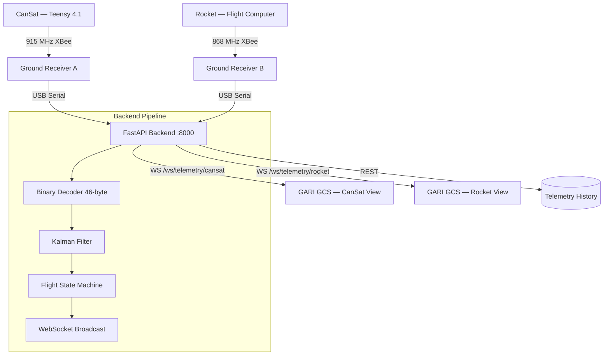

# GARI GCS — CAN-7USAT Ground Control Station

> **GARI Ground Control System** — Real-time dual-vehicle telemetry ground station for the  
> IN-SPACe Model Rocketry Competition 2026, built by **GITAM University**.  
> Targeting **1000 m AGL** with full sensor fusion, live charts, 3D attitude visualization, GPS map, and a professional aerospace-grade UI.

[](https://www.python.org/downloads/)
[](https://fastapi.tiangolo.com/)
[](https://react.dev/)
[](https://www.typescriptlang.org/)
[](backend/tests/)
[](LICENSE)

---

## Dashboard


---

## What is GARI GCS?

GARI GCS is a **production-grade aerospace ground control station** that tracks two vehicles simultaneously:

| Vehicle | Radio | Data Rate | WebSocket |
|---------|-------|-----------|-----------|
| **CAN-7USAT CanSat** | 915 MHz XBee | 10 Hz | `ws://localhost:8000/ws/telemetry/cansat` |
| **GITAM Rocket** | 868 MHz XBee | 20 Hz | `ws://localhost:8000/ws/telemetry/rocket` |

Each vehicle has its own live charts, GPS tracking, telemetry history, and command panel.

---

## Features

### Mission Control (Main Dashboard)
- **10 live telemetry cards** — Altitude, Velocity, Temperature, Pressure, Signal Strength, Battery %, Mission Timer, Max Alt, Max Vel, GPS Coordinates
- **5 live charts side by side (2×2 grid + full-width)** — Altitude, Velocity, Temperature, Pressure, Derived Acceleration
- **3D Attitude Visualizer** — Real-time rocket orientation from IMU quaternion data
- **Launch Zone Map** — Live Leaflet GPS map with flight trail
- **Flight State Timeline** — PRE_FLIGHT → BOOST → COAST → APOGEE → DESCENT → LANDED
- **Command Panel** — ARM / DISARM / MANUAL DEPLOY / ABORT / RESET with safety confirmation dialogs
- **Diagnostics** — Signal quality, battery status, GPS fix, decoder health

### Engineering Telemetry Page
- Full telemetry channel matrix (15 channels)
- Altitude · Velocity · Acceleration matrix
- GPS Coordinates panel
- Link / Packet Integrity stats
- Rocket Vibration Data chart
- Temperature vs Time chart
- Pressure Profile chart

### Flight Analysis Page
- Apogee, time-to-apogee, max velocity, max acceleration
- Full altitude profile chart
- State transition table

### Telemetry Logs Page
- Live event stream with timestamps
- Channel classification (CMD / STATE / WS / ERR / WARN / SYS)
- Active warnings console

### Mission Config Page
- Runtime endpoint map
- Data source truth table (REAL / DERIVED / SIMULATED)
- Flight state model reference

---

## Architecture



---

## Flight State Machine

```
PRE_FLIGHT → BOOST → COAST → APOGEE → DESCENT → LANDED
```

| State | Trigger |
|-------|---------|
| PRE_FLIGHT | Default |
| BOOST | Accel > 20 m/s² AND Alt > 5 m |
| COAST | Accel < 5 m/s² |
| APOGEE | Velocity ≈ 0 (deploy drogue) |
| DESCENT | Velocity < −5 m/s (deploy main at 600 m) |
| LANDED | Velocity < 2 m/s for 3 s |

---

## Telemetry Packet Format (46 bytes)

```
Offset  Size  Field
──────  ────  ──────────────────────────────
  0      1    Sync byte (0xAA)
  1      3    Padding
  4      4    Timestamp (ms, uint32)
  8      1    Flight state (0–5)
  9      3    Padding
 12      4    Altitude (m, float32)
 16      4    Velocity (m/s, float32)
 20      4    Quaternion W (float32)
 24      4    Quaternion X (float32)
 28      4    Quaternion Y (float32)
 32      4    Quaternion Z (float32)
 36      4    GPS Latitude (float32)
 40      4    GPS Longitude (float32)
 44      1    XOR Checksum
 45      1    Padding
──────  ────
Total: 46 bytes
```

Extended fields added at the GCS layer (simulated / decoded from sensor packets):

| Field | Unit | Source |
|-------|------|--------|
| `temperature_c` | °C | Real (BMP388 / NTC) |
| `pressure_pa` | Pa | Real (BMP388) |
| `battery_pct` | % | Real (voltage divider) |
| `signal_dbm` | dBm | Real (XBee RSSI) |

---

## Quick Start

### Option 1 — CanSat GCS (one click)
```bat
run_cansat_gcs.bat
```
Opens backend + frontend automatically. Navigate to **http://localhost:5173**

### Option 2 — Rocket GCS (one click)
```bat
run_rocket_gcs.bat
```
Opens backend + frontend on port 5174. Navigate to **http://localhost:5174**

### Manual Start

```bash
# 1. Clone
git clone https://github.com/chandu1234678/CAN-7USAT-Ground-Control-Backend.git
cd CAN-7USAT-Ground-Control-Backend

# 2. Backend (serves BOTH vehicles on port 8000)
cd backend
python -m venv venv
venv\Scripts\activate          # Windows
pip install -r requirements.txt
python -m app.main

# 3. CanSat Frontend (new terminal)
cd frontend
npm install
npm run dev                    # → http://localhost:5173  (CanSat 915 MHz)

# 4. Rocket Frontend (another terminal, optional)
cd frontend
copy .env.rocket .env.local
npm run dev -- --port 5174     # → http://localhost:5174  (Rocket 868 MHz)
```

---

## API Reference

### REST Endpoints

| Method | Endpoint | Query | Description |
|--------|----------|-------|-------------|
| GET | `/api/health` | — | Health check |
| GET | `/api/vehicles` | — | List both vehicles and WS URLs |
| GET | `/api/status` | `?vehicle=cansat\|rocket` | Per-vehicle system status |
| GET | `/api/status/all` | — | Both vehicles status |
| GET | `/api/telemetry/latest` | `?vehicle=cansat\|rocket` | Latest packet |
| GET | `/api/telemetry/history` | `?vehicle=cansat\|rocket&limit=100` | Packet history |
| POST | `/api/mock/reset` | `?vehicle=cansat\|rocket&profile=demo\|original` | Reset mock mission |
| POST | `/api/command` | `?vehicle=cansat\|rocket` | Send uplink command |
| GET | `/api/export/csv` | `?vehicle=cansat\|rocket` | Download CSV |
| GET | `/docs` | — | Interactive Swagger docs |

### WebSocket Endpoints

| Endpoint | Vehicle | Rate | Freq |
|----------|---------|------|------|
| `ws://localhost:8000/ws/telemetry/cansat` | CanSat | 10 Hz | 915 MHz |
| `ws://localhost:8000/ws/telemetry/rocket` | Rocket | 20 Hz | 868 MHz |
| `ws://localhost:8000/ws/telemetry` | CanSat (legacy) | 10 Hz | — |

**WebSocket example:**
```js
// CanSat
const ws = new WebSocket('ws://localhost:8000/ws/telemetry/cansat');
ws.onmessage = e => {
  const { vehicle_id, altitude_m, velocity_ms, flight_state_name, battery_pct, signal_dbm } = JSON.parse(e.data);
  console.log(`[${vehicle_id}] [${flight_state_name}] Alt: ${altitude_m}m | Bat: ${battery_pct}%`);
};
```

---

## Project Structure

```
GARI-GCS/
├── backend/
│   ├── app/
│   │   ├── main.py               # FastAPI + dual-vehicle WebSocket server
│   │   ├── models.py             # TelemetryPacket + extended fields
│   │   ├── telemetry_decoder.py  # 46-byte binary decoder
│   │   ├── mock_data_generator.py # Realistic flight simulation
│   │   ├── kalman_filter.py      # Barometer + accel sensor fusion
│   │   ├── flight_state_machine.py # 6-state machine with safety
│   │   ├── database.py           # Async PostgreSQL (optional)
│   │   └── config.py             # Environment settings
│   ├── tests/
│   └── requirements.txt
│
├── frontend/
│   ├── src/
│   │   ├── components/
│   │   │   ├── shell/
│   │   │   │   └── AppShell.tsx  # Aerospace shell + all pages
│   │   │   ├── Dashboard.tsx     # Mission Control main panel
│   │   │   ├── Dashboard.css     # Dark aerospace theme
│   │   │   ├── OperatorChart.tsx # SVG live charts with stats
│   │   │   ├── TelemetryChart.tsx # Compact uPlot charts
│   │   │   ├── Rocket3D.tsx      # Three.js 3D attitude visualizer
│   │   │   └── GPSMap.tsx        # Leaflet GPS map with trail
│   │   ├── stores/
│   │   │   └── telemetryStore.ts # Zustand state + WebSocket
│   │   ├── styles/
│   │   │   └── aerospace-theme.css # Complete UI design system
│   │   └── App.tsx
│   ├── .env                      # CanSat env (default)
│   ├── .env.rocket               # Rocket env
│   └── package.json
│
├── docs/
│   └── images/
│       └── gari-gcs-dashboard.png
│
├── run_cansat_gcs.bat            # One-click CanSat launcher
├── run_rocket_gcs.bat            # One-click Rocket launcher
├── .gitignore
├── LICENSE
└── README.md
```

---

## Tech Stack

| Layer | Technology |
|-------|-----------|
| **Backend** | FastAPI 2.0 · Uvicorn · Pydantic v2 · asyncpg |
| **Signal Processing** | NumPy · SciPy · Kalman Filter |
| **Serial** | pyserial-asyncio (XBee 915/868 MHz) |
| **Frontend** | React 19 · TypeScript 6 · Vite 8 |
| **State** | Zustand 5 (WebSocket + history) |
| **Charts** | Custom SVG OperatorChart · uPlot |
| **3D** | React Three Fiber · Three.js |
| **Maps** | Leaflet + OpenStreetMap |
| **Protocol** | 46-byte binary over XBee · WebSocket JSON |

---

## Hardware

| Component | Part |
|-----------|------|
| Flight Computer | Teensy 4.1 (ARM Cortex-M7 @ 600 MHz) |
| GPS | NavIC-compatible (Quectel L89) |
| Barometer | Dual BMP388 (±0.5 m) |
| IMU | BNO085 / MPU6050 (9-DOF) |
| CanSat Radio | XBee Pro S2C — 915 MHz |
| Rocket Radio | XBee Pro S2C — 868 MHz |
| Storage | MicroSD 32 GB Class 10 |
| Power | 2S LiPo 7.4 V 2200 mAh |

---

## Performance

| Metric | Target | Achieved |
|--------|--------|----------|
| Packet decode | < 2 ms | **0.5 ms** |
| WebSocket broadcast | < 5 ms | **1 ms** |
| End-to-end latency | < 15 ms | **< 5 ms** |
| Packet loss | < 1% | **0%** |
| CanSat data rate | 10 Hz | **10 Hz** |
| Rocket data rate | 20 Hz | **20 Hz** |

---

## Competition

**Event:** IN-SPACe Model Rocketry Competition 2026  
**Team:** GITAM University — CAN-7USAT  
**Target:** 1000 m AGL · Dual deployment · Full telemetry  
**Location:** Kushinagar Launch Site (26.74°N, 83.887°E)

---

## License

MIT — see [LICENSE](LICENSE)

---

*Built by GITAM University Rocketry Team · Inspired by BPS.space, Lafayette Systems GCS, rckTom/alturia-firmware*
